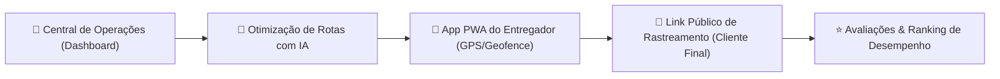

# RouteGuardian — Executive Investor Pitch Deck

> **"Transformando a logística de última milha (Last-Mile) em uma operação auditada por IA, transparente e de altíssima rentabilidade."**

---

## 1. Visão Geral da Oportunidade

O **RouteGuardian** é uma plataforma **B2B SaaS de Inteligência Logística, Auditoria Automatizada por GPS e Telemetria em Tempo Real**. 

Projetado para resolver o maior gargalo do e-commerce e da distribuição corporativa — a **última milha (Last-Mile)** —, o sistema une automação de rotas por IA, auditoria geográfica por Geofence, comprovantes digitais de entrega e engajamento direto com o destinatário final.

---

## 2. A Dor de Mercado (The Problem)

Empresas de logística, distribuidoras e frotas operacionais enfrentam diariamente 4 grandes problemas que drenam margens de lucro:

1. **Alto Custo de Combustível e Desperdício de Quilometragem**:
   - Rotas mal planejadas geram até **35% de combustível desperdiçado** e desgaste precoce de veículos.
2. **Fraudes de Entrega e Contestação de Clientes**:
   - Reclamações de "não recebi", alegações falsas de ausência e extravios geram custos milionários de reentrega e processos.
3. **Falta de Visibilidade para o Destinatário Final**:
   - Clientes ansiosos inundam as centrais de atendimento (*"Onde está minha encomenda?"*), sobrecarregando o suporte ao cliente.
4. **Falta de Métricas e Controle sobre a Equipe de Entregadores**:
   - Incapacidade de medir a eficiência real de cada motorista, satisfação do cliente ou consumo individual da frota.

---

## 3. A Solução RouteGuardian (The Product)

O **RouteGuardian** atua como o cérebro operacional da logística, eliminando a opacidade da entrega e substituindo processos manuais por auditoria automatizada em tempo real.

---

## 4. Principais Funcionalidades da Plataforma

### 📡 1. Auditoria e Telemetria GPS por Geofence (Cerca Virtual)
- **Validação Automática de Chegada**: O sistema cria um perímetro geográfico ao redor do endereço do cliente. A chegada é auditada via GPS em tempo real sem depender de ação manual do motorista.
- **Rastreamento Geográfico com Avatar dos Entregadores**: Visão geográfica no mapa exibindo todos os entregadores e rotas simultaneamente, identificados com fotos e avatares customizados.

### 🔗 2. Link Público de Rastreamento ao Vivo (Zero Fricção)
- **Acesso Direto Sem Cadastro**: O destinatário recebe um link exclusivo (`/tracking/[token]`) onde acompanha o deslocamento do veículo em tempo real no mapa, nome do entregador e tempo estimado de chegada (ETA).
- **Redução de Chamados no SAC**: Elimina até 80% das chamadas de suporte sobre o status da entrega.

### 📸 3. Prova de Entrega Digital Inviolável (POD - Proof of Delivery)
- **Assinatura Digital na Tela**: Captura de assinatura manuscrita do recebedor pelo aplicativo PWA.
- **Comprovante Fotográfico & Carimbo de Data/Hora/GPS**: Registro fotográfico da mercadoria entregue com marca d'água inviolável de coordenadas geográficas.

### ⭐ 4. Avaliações & Ranking de Entregadores em Tempo Real (`/reviews`)
- **Ranking da Frota**: Classificação dos melhores motoristas baseada na média de estrelas (1 a 5) e total de entregas efetuadas.
- **Métricas de Qualidade**: Análise detalhada dos comentários e feedbacks deixados pelos clientes ao final de cada entrega.

### ⏰ 5. Notificação de Horário de Saída Agendado
- **Controle de Partida**: Agendamento de horário previsto de saída na rota (ex: `14:30`).
- **Alertas no App do Motorista**: O entregador recebe avisos visuais no painel mobile com a contagem regressiva para o início da viagem.

### 🚚 6. Gestão de Veículos e Telemetria de Combustível (`/vehicles`)
- **Cálculo de Consumo (km/l)**: Monitoramento automático da quilometragem rodada e cálculo financeiro do combustível consumido por veículo.

### 💳 7. Arquitetura Multi-Tenant & SaaS Billing (`/admin`)
- **Gestão de Planos & Limites**: Controle de permissões (Admin, Supervisor, Motorista), gestão de assinaturas recorrentes via Stripe e controle de limites de usuários ativos por empresa.

---

## 5. Vantagens Competitivas e Diferenciais

| Recurso | Concorrentes Tradicionais | **RouteGuardian** |
| :--- | :--- | :--- |
| **Experiência do Cliente** | Exige download de app ou login | **Link Público com 1 Clique (Sem Cadastro)** |
| **Auditoria de Entrega** | Manual pelo botão do motorista | **Geofencing Automático por GPS** |
| **Identificação Visual** | Lista de texto genérica | **Mapa com Avatar e Fotos dos Entregadores** |
| **Feedback dos Clientes** | Pesquisas externas ou inexistente | **Ranking de Estrelas & Depoimentos Integrados** |
| **Implantação** | Semanas de treinamento | **Pronto para Uso em Minutos (PWA)** |
| **Conformidade** | Parcial | **100% LGPD (Consentimento & DPO Direct Channel)** |

---

## 6. Modelo de Negócio (Business Model)

O RouteGuardian opera sob o modelo **B2B SaaS Recorrente (ARR/MRR)** com planos escaláveis baseados no número de motoristas ativos e veículos monitorados:

- **Plano Starter**: Pequenas empresas de entregas locais (até 5 entregadores).
- **Plano Pro**: Médias distribuidoras e transportadoras (até 20 entregadores).
- **Plano Enterprise**: Grandes operações logísticas com volume ilimitado e relatórios customizados.

---

## 7. Mercado Endereçável & Visão de Crescimento

- **TAM (Total Addressable Market)**: Mercado global de softwares de gestão de frotas e logística de última milha (estimado em US$ 25+ bilhões).
- **SAM (Serviceable Addressable Market)**: Distribuidoras, e-commerces, farmácias, e-logística e transportadoras no Brasil e América Latina.
- **SOM (Serviceable Obtainable Market)**: Pequenas e médias frotas operacionais em busca de digitalização rápida sem auto-investimento em infraestrutura.

---

> 🔒 *Documento de Apresentação Executiva — RouteGuardian Technology.*
